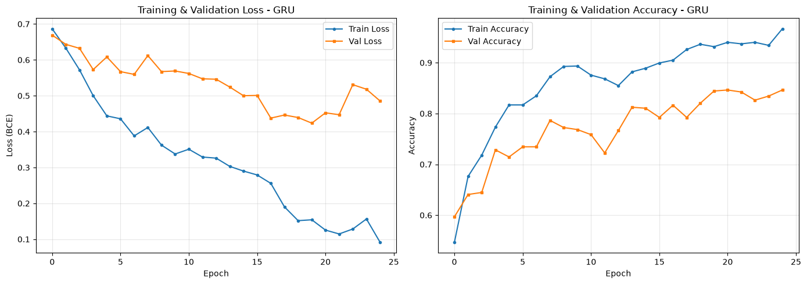

# Nhận Diện Tin Tức Giả Bằng PyTorch (So Sánh RNN vs LSTM vs GRU)

Dự án Học Sâu (Deep Learning) toàn diện về bài toán phân loại văn bản: **Xác thực Tin Thật (Real News) hay Tin Giả (Fake News)** sử dụng thư viện **PyTorch thuần**. 

Dự án xây dựng một quy trình hoàn chỉnh từ dữ liệu thô, tiền xử lý, thiết kế kiến trúc mạng nơ-ron hồi quy, huấn luyện đánh giá mô hình, cho đến việc đóng gói thành các công cụ dòng lệnh (CLI) dễ dàng tái hiện trên bất kỳ máy tính nào.

---

## 1. Tổng Quan Bài Toán

Trong thời đại số hóa và mạng xã hội, tin giả (Fake News / Misinformation) xuất hiện tràn lan với nội dung giật gân, bóp méo sự thật nhằm mục đích câu view, thao túng dư luận hoặc lừa đảo.

Dự án này giải quyết bài toán phân loại nhị phân (Binary Classification):
- **Nhãn 0 (Real News - Tin Thật):** Bài báo chính thống, đã qua kiểm duyệt thực tế.
- **Nhãn 1 (Fake News - Tin Giả):** Bài viết sai lệch, không có căn cứ xác thực.

Mục tiêu cốt lõi: So sánh thực nghiệm xem giữa **Simple RNN**, **LSTM** và **GRU**, kiến trúc nào có khả năng học và ghi nhớ ngữ cảnh văn bản dài tốt nhất để ngăn chặn tin giả hiệu quả.

---

## 2. Cấu Trúc Thư Mục Dự Án

```text
Fake-News-Detection-PyTorch/
├── assets/
│   └── gru_training_loss_acc.png
├── data/
│   └── Fake_News_Detection_Dataset.csv
├── notebooks/
│   ├── Fake_News_RNN.ipynb
│   ├── Fake_News_LSTM.ipynb
│   └── Fake_News_GRU.ipynb
├── src/
│   ├── preprocess.py
│   ├── models.py
│   ├── train.py
│   └── predict.py
├── saved_models/
│   ├── vocab.pkl
│   ├── best_lstm_model.pth
│   ├── best_gru_model.pth
│   └── best_rnn_model.pth
├── requirements.txt
├── .gitignore
└── README.md
```

---

## 3. Quy Trình Kỹ Thuật (Pipeline)

- **Bước 1 (Làm sạch văn bản):** Chuyển toàn bộ chữ về chữ thường, dùng Regex lọc bỏ dấu câu và ký tự lạ, chỉ giữ lại chữ cái và số.
- **Bước 2 (Mã hóa số học & Vocab):** Chọn 10.000 từ phổ biến nhất làm từ điển. Gán thêm token `<PAD>` (chỉ số 0 - bù độ dài) và `<UNK>` (chỉ số 1 - từ lạ). Cắt/bù các câu về độ dài cố định 150 từ.
- **Bước 3 (Embedding Layer):** Biến mỗi từ thành vector 128 chiều liên tục để giữ mối quan hệ ngữ nghĩa giữa các từ.
- **Bước 4 (Huấn luyện mô hình):** So sánh 3 kiến trúc:
  - **Simple RNN:** Mạng hồi quy cơ bản (dễ quên ngữ cảnh khi câu dài).
  - **LSTM:** Dùng Cell State và 3 cổng (Forget, Input, Output) giúp ghi nhớ bài báo dài rất tốt.
  - **GRU:** Bản rút gọn của LSTM với 2 cổng (Reset, Update), chạy nhanh và hiệu năng cao.
- **Bước 5 (Đầu ra & Tối ưu):** Dùng hàm mất mát `BCELoss`, hàm kích hoạt `Sigmoid` (xác suất $\ge 0.5 \rightarrow$ Tin Giả) và thuật toán tối ưu `Adam`.

| Đặc điểm | GRU | LSTM |
| :--- | :--- | :--- |
| **Số cổng** | 2 (Update, Reset) | 3 (Forget, Input, Output) |
| **Trạng thái** | Chỉ có Hidden State | Hidden State + Cell State |
| **Tham số** | Ít hơn (~30%) | Nhiều hơn |
| **Tốc độ huấn luyện** | Nhanh hơn | Chậm hơn |
| **Hiệu quả** | Tương đương LSTM trên nhiều tác vụ | Tốt hơn trên chuỗi rất dài |

---

## 4. Kết Quả Huấn Luyện & Đánh Giá Chi Tiết

### Bảng Tổng Hợp So Sánh 3 Kiến Trúc
Kết quả đo lường trên cùng tập kiểm thử độc lập (Test Set gồm 501 mẫu):

| Kiến Trúc Mô Hình | Độ Chính Xác (Accuracy) | F1-Score | Precision (Tin Giả) | Recall (Tin Giả) | Thời Gian Train / Epoch | Nhận Xét Đánh Giá |
| :--- | :---: | :---: | :---: | :---: | :---: | :--- |
| **Simple RNN** | `64.07%` | `0.68` | `0.62` | `0.75` | Nhanh nhất (~1s) | **Kém nhất:** Bị triệt tiêu đạo hàm, khả năng nhớ kém trên bài báo dài. |
| **GRU** | `88.82%` | `0.91` | `0.92` | `0.90` | Trung bình (~2s) | **Cân bằng xuất sắc:** Hội tụ nhanh, độ chính xác cao gần như tương đương LSTM. |
| **LSTM (Tốt nhất)** | **`89.50%`** | **`0.91`** | **`0.91`** | **`0.92`** | ~2.5s | **Vượt trội:** Khả năng ghi nhớ ngữ cảnh dài rất tốt, bắt chuẩn xác **92%** số lượng tin giả. |

---

### Biểu Đồ Quá Trình Huấn Luyện (Training Loss & Accuracy - GRU)



---

### Chi Tiết Đánh Giá Trên Tập Kiểm Thử (Minh Họa Mô Hình GRU)

```text
==================================================
KẾT QUẢ ĐÁNH GIÁ - GRU
==================================================
Accuracy:  0.8882 (88.82%)
Precision: 0.9153 (91.53%)
Recall:    0.9035 (90.35%)
F1-Score:  0.9094 (90.94%)
==================================================

Ma Trận Nhầm Lẫn (Confusion Matrix):
[[164  26]
 [ 30 281]]

Báo Cáo Chi Tiết (Classification Report):
              precision    recall  f1-score   support

Tin thật (0)       0.85      0.86      0.85       190
 Tin giả (1)       0.92      0.90      0.91       311

    accuracy                           0.89       501
   macro avg       0.88      0.88      0.88       501
weighted avg       0.89      0.89      0.89       501
```

---

### Kết Quả Dự Đoán Thử Nghiệm Trên 10 Mẫu Thực Tế

Sau khi huấn luyện xong, mô hình được kiểm tra ngẫu nhiên trên 10 bài báo trong tập Test Set để đối chiếu giữa Nhãn thực tế và Nhãn mô hình dự đoán:

```text
================================================================================
DỰ ĐOÁN TIN GIẢ TRÊN MẪU THỰC TẾ - GRU
================================================================================
Mẫu   | Nhãn thực   | Nhãn dự đoán | Xác suất  | Kết quả
--------------------------------------------------------------------------------
1     | Giả         | Giả          | 0.9959    | Đúng
2     | Thật        | Thật         | 0.0101    | Đúng
3     | Giả         | Giả          | 0.9825    | Đúng
4     | Thật        | Thật         | 0.0117    | Đúng
5     | Thật        | Giả          | 0.6236    | Sai
6     | Giả         | Giả          | 0.9978    | Đúng
7     | Giả         | Thật         | 0.0510    | Sai
8     | Thật        | Thật         | 0.0066    | Đúng
9     | Giả         | Giả          | 0.9926    | Đúng
10    | Giả         | Giả          | 0.9437    | Đúng
================================================================================
```

> **Chi tiết một mẫu dự đoán điển hình:**
> ```text
> ============================================================
> CHI TIẾT MẪU DỰ ĐOÁN - GRU
> ============================================================
> Nhãn thực tế:     Giả (1)
> Nhãn dự đoán:     Giả (1)
> Xác suất tin giả: 0.9952 (99.52%)
> Chênh lệch:       0.0048
> Kết quả:          ĐÚNG
> ============================================================
> ```

---

## 5. Đánh Giá & Kết Luận Chuyên Môn

1. **Tại sao Recall của Tin Giả là chỉ số quan trọng nhất?**
   - Trong bài toán phát hiện tin tức giả hoặc lừa đảo, việc **đoán nhầm tin giả thành tin thật (False Negative)** nguy hiểm hơn nhiều so với việc nghi ngờ nhầm một tin thật.
   - Cả mô hình **LSTM** và **GRU** đều đạt chỉ số **Recall trên 90%** cho lớp Tin Giả, chứng minh cơ chế cổng kiểm soát dòng thông tin giúp mô hình không bị bỏ sót các bài viết sai sự thật.
2. **So sánh đánh đổi (Trade-off):**
   - **GRU:** Tốc độ huấn luyện nhanh, tham số ít hơn ~30%, phù hợp triển khai trên các hệ thống thời gian thực hoặc thiết bị có tài nguyên tính toán giới hạn.
   - **LSTM:** Có Cell State độc lập với Hidden State, thể hiện ưu thế vượt trội khi xử lý các bài báo có độ dài lớn và ngữ cảnh phức tạp.

---

## 6. Hướng Dẫn Cài Đặt & Chạy Kiểm Thử

### 1. Cài đặt thư viện
Mở Terminal tại thư mục dự án và chạy lệnh:

```bash
pip install -r requirements.txt
```

### 2. Kiểm thử độc lập từng thành phần (Unit Test)
Mỗi module đều được thiết kế độc lập, có thể chạy riêng để kiểm tra tính đúng đắn:

- Kiểm tra bộ tiền xử lý và chuyển chuỗi văn bản:
  ```bash
  python src/preprocess.py
  ```

- Kiểm tra luồng tính toán ma trận của 3 mô hình:
  ```bash
  python src/models.py
  ```

### 3. Huấn luyện mô hình (Training qua CLI)
Bạn có thể tự do huấn luyện bất kỳ mô hình nào qua tham số dòng lệnh:

```bash
# Huấn luyện mô hình LSTM (Mặc định)
python src/train.py --model lstm --epochs 10 --batch_size 64

# Huấn luyện mô hình GRU
python src/train.py --model gru --epochs 10 --batch_size 64

# Huấn luyện mô hình Simple RNN (Baseline)
python src/train.py --model rnn --epochs 10 --batch_size 64
```
*Mô hình có chỉ số Validation Accuracy cao nhất sẽ tự động được lưu vào thư mục `saved_models/`.*

### 4. Dự đoán bài báo bất kỳ (Inference)
Chạy chế độ tương tác hỏi đáp trực tiếp (có menu chọn 1/2/3 để chuyển đổi giữa LSTM, GRU và RNN):

```bash
python src/predict.py
```

Hoặc truyền trực tiếp câu bài báo cần kiểm tra qua tham số `--text`:

```bash
python src/predict.py --model lstm --text "Scientists discover ancient water reservoir deep beneath the surface of Mars."
```

**Kết quả hiển thị trên Terminal:**
```text
==================================================
KET QUA PHAN LOAI BAI BAO:
Noi dung: "Scientists discover ancient water reservoir deep beneath the surface of Mars."
Phan loai: TIN THAT (Real News)
Do tin cay (Confidence): 89.25% (Xac suat raw: 0.1075)
==================================================
```
